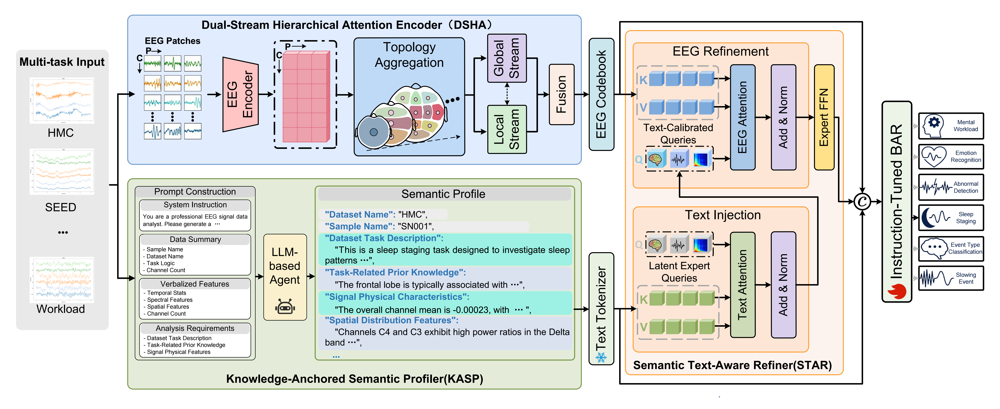

# KAST-BAR: Knowledge-Anchored Semantically-Dynamic Topology Brain Autoregressive Modeling for Universal Neural Interpretation


## Abstract

While EEG foundation models have shown significant potential in universal neural decoding across tasks, their advancement remains constrained by the inadequacy modeling of complex spatiotemporal topology, as well as the inherent modality gap between low-level physiological signals and high-level textual semantics.
To address these challenges, we propose a Knowledge-Anchored Semantically-Dynamic Topology Brain Autoregressive Model (KAST-BAR), which dynamically aligns physiological representations derived from multi-level brain topology with an expert-level semantic space. 
Specifically, we design a Dual-Stream Hierarchical Attention (DSHA) encoder that accurately captures the brain's intrinsic non-Euclidean topology by modeling local temporal dynamics with global spatial contexts. 
On this basis, a Knowledge-Anchored Semantic Profiler (KASP) is proposed to synthesize physically-grounded and instance-level textual profiles, which subsequently drive a Semantic Text-Aware Refiner (STAR) to dynamically reconstruct EEG representations using Latent Expert Queries. 
By conducting large-scale pre-training on 21 diverse datasets to build a foundation model, KAST-BAR effectively integrates expert-level medical knowledge into EEG signal representations, consistently achieving superior performance across six downstream tasks. 

## Environment Set Up

To install requirements:

```bash
conda create -n KAST-BAR python=3.12
conda activate KAST-BAR
pip install -r requirements.txt
```
## Run Experiments
The training pipeline consists of four progressive stages:

1. Stage 1: EEG Tokenizer Training

Train the Dual-Stream Hierarchical Attention (DSHA) encoder to perform topology-enhanced discretized encoding of EEG data. This stage captures robust spatiotemporal features via self-supervised reconstruction.

```bash
# Train the DSHA Encoder and VQ module
sh scripts/sh_train_DSHA.sh
```
2. Stage 2: Semantic Profile Generation

Utilize the Knowledge-Anchored Semantic Profiler (KASP) to generate instance-specific semantic profiles for the EEG data. This step employs a frozen LLM (e.g., Qwen-2.5) to transform explicit signal statistics into expert-level medical descriptions, which serve as semantic anchors for the subsequent pre-training.

```bash
sh profile_maker/scripts/sh_analyze_eeg_directory_ddp.sh
```

3. Stage 3: Joint Autoregressive Pre-training

Pre-train the KAST-BAR backbone. In this stage, the model learns to process a hybrid sequence comprising KASP-generated semantic profiles, STAR-guided aggregated features, and Discrete EEG tokens.

```bash
# Pre-train the BAR model with KASP-STAR integration
sh scripts/sh_train_dualSTAR_pretrain.sh
```

4. Stage 4: Multi-task Instruction Fine-tuning

Fine-tune the pre-trained model on downstream tasks (e.g., Seizure Detection, Sleep Staging, Emotion Recognition) using Instruction Tuning. We employ a decoupled strategy: a new LoRA adapter is initialized for the backbone, while the STAR encoder undergoes full-parameter fine-tuning.
```bash
# Run instruction fine-tuning on downstream datasets
sh scripts/sh_train_instruction_KAST_BAR.sh

```
